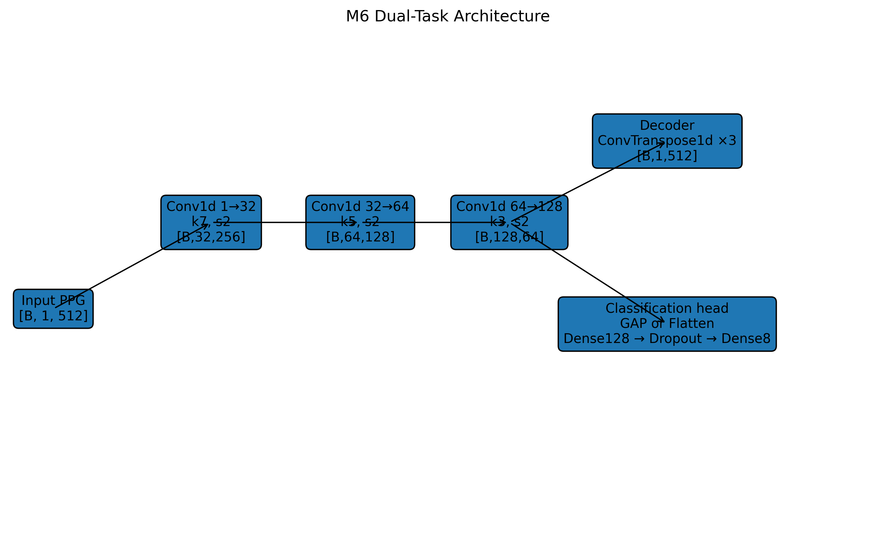

# M6 — Dual-Task Autoencoder for PPG Reconstruction and Activity Recognition

> Đề tài M6 — Học phần **Trí tuệ nhân tạo cho IoT (AIOT331185)**  
> **Sinh viên:** Phan Hồng Phúc — **MSSV:** 23110141  
> **Giảng viên hướng dẫn:** ThS. Hồ Nhựt Minh

## 1. Giới thiệu

Dự án xây dựng và đánh giá một **Dual-Task Autoencoder** trên tín hiệu **PPG/BVP cổ tay** của bộ dữ liệu **PPG-DaLiA** cho hai nhiệm vụ:

1. **Tái tạo tín hiệu BVP đầu vào đã chuẩn hóa**.
2. **Phân loại 8 hoạt động** từ tín hiệu BVP.

Trọng tâm thực nghiệm là so sánh hai cách gom đặc trưng tại nhánh phân loại:

- **Global Average Pooling (GAP)**
- **Flatten**

Ngoài ra, dự án đối chứng mô hình đa nhiệm với các mô hình phân loại đơn nhiệm có cùng head để đánh giá liệu **reconstruction loss** có thực sự hỗ trợ bài toán phân loại hay không.

---

## 2. Câu hỏi nghiên cứu

- **RQ1:** GAP và Flatten khác nhau như thế nào về **Accuracy, Macro-F1, MSE và PRD_c**?
- **RQ2:** Việc thêm nhiệm vụ tái tạo có cải thiện phân loại so với mô hình phân loại đơn nhiệm hay không?
- **RQ3:** GAP giảm được bao nhiêu **tham số, dung lượng trọng số và độ trễ CPU** so với Flatten?

---

## 3. Bộ dữ liệu

Dự án sử dụng **PPG-DaLiA** với dữ liệu đồng bộ theo từng người tham gia.

- **Nguồn:** UCI Machine Learning Repository
- **DOI:** `10.24432/C53890`
- **Số subject:** 15
- **Tín hiệu sử dụng:** BVP cổ tay
- **Tần số lấy mẫu:** 64 Hz
- **Số lớp hoạt động:** 8

### 8 lớp hoạt động

| Nhãn mô hình | Hoạt động |
|---:|---|
| 0 | BASELINE |
| 1 | STAIRS |
| 2 | SOCCER |
| 3 | CYCLING |
| 4 | DRIVING |
| 5 | LUNCH |
| 6 | WALKING |
| 7 | WORKING |

> Trường `activity` được dùng làm nhãn hoạt động. Trường `label` dùng cho nhịp tim không được dùng làm nhãn phân loại.

---

## 4. Tiền xử lý dữ liệu

Pipeline chính được cố định để hạn chế rò rỉ dữ liệu và đảm bảo khả năng tái lập.

- BVP: **64 Hz**
- Window: **8 giây = 512 mẫu**
- Stride: **4 giây = 256 mẫu**
- Overlap: **50%**
- Chỉ giữ cửa sổ thuộc **một hoạt động hợp lệ duy nhất**
- Không dùng majority voting ở vùng chuyển tiếp
- Không dùng digital band-pass filter trong pipeline chính
- Chuẩn hóa bằng **global z-score chỉ học từ Train**

### Chia dữ liệu theo subject

| Tập | Subject | Số cửa sổ |
|---|---|---:|
| Train | S1–S9 | 13,705 |
| Validation | S10–S12 | 4,967 |
| Test | S13–S15 | 4,707 |
| **Tổng** | 15 subject | **23,379** |

### Thống kê chuẩn hóa Train

- `mean = 0.004277964825032665`
- `std = 76.028651766159`
- Số điểm Train duy nhất dùng tính scaler: `3,526,144`

Validation và Test sử dụng nguyên thống kê từ Train.

---

## 5. Kiến trúc mô hình

Encoder 1D-CNN dùng chung:

```text
Input [B, 1, 512]
      ↓
Conv1d 1 → 32, k=7, s=2
      ↓
[B, 32, 256]
      ↓
Conv1d 32 → 64, k=5, s=2
      ↓
[B, 64, 128]
      ↓
Conv1d 64 → 128, k=3, s=2
      ↓
Z = [B, 128, 64]
```

Nhánh tái tạo:

```text
Z
↓
ConvTranspose1d 128 → 64
↓
ConvTranspose1d 64 → 32
↓
ConvTranspose1d 32 → 1
↓
Reconstruction [B, 1, 512]
```

Nhánh phân loại GAP:

```text
[B, 128, 64]
↓
Global Average Pooling
↓
[B, 128]
↓
Linear(128, 128)
↓
Dropout(0.2)
↓
Linear(128, 8)
```

Nhánh phân loại Flatten:

```text
[B, 128, 64]
↓
Flatten
↓
[B, 8192]
↓
Linear(8192, 128)
↓
Dropout(0.2)
↓
Linear(128, 8)
```



---

## 6. Năm cấu hình thực nghiệm

| Mô hình | Encoder | Decoder | Head phân loại | Loss |
|---|---:|---:|---|---|
| **MTL-GAP** | ✓ | ✓ | GAP | MSE + CE |
| **MTL-Flat** | ✓ | ✓ | Flatten | MSE + CE |
| **CNN-GAP** | ✓ | — | GAP | CE |
| **CNN-Flat** | ✓ | — | Flatten | CE |
| **AE** | ✓ | ✓ | — | MSE |

Trong thí nghiệm đa nhiệm:

```text
L = L_rec + γ L_cls
```

với `γ = 1`.

---

## 7. Cấu hình huấn luyện

| Tham số | Giá trị |
|---|---|
| Framework | PyTorch |
| Optimizer | Adam |
| Learning rate | 0.001 |
| Weight decay | 0 |
| Batch size | 64 |
| Epoch tối đa | 100 |
| Early stopping | Patience = 10 |
| Dropout | 0.2 |
| Seed | 42, 43, 44 |
| Main γ | 1.0 |

### Quy tắc chọn checkpoint

- Mô hình có phân loại: chọn checkpoint có **subject-mean Macro-F1 cao nhất trên Validation**.
- AE: chọn checkpoint có **subject-mean MSE thấp nhất trên Validation**.
- **Không dùng Test để chọn checkpoint hoặc điều chỉnh mô hình.**

---

## 8. Kết quả chính

| Mô hình | Accuracy | Macro-F1 | MSE | PRD_c (%) |
|---|---:|---:|---:|---:|
| **MTL-GAP** | **0.4645 ± 0.0371** | **0.3768 ± 0.0456** | **0.00197 ± 0.00062** | **4.283 ± 0.880** |
| MTL-Flat | 0.4149 ± 0.0018 | 0.3555 ± 0.0021 | 0.00660 ± 0.00165 | 7.589 ± 1.102 |
| **CNN-GAP** | **0.4913 ± 0.0116** | **0.4104 ± 0.0188** | — | — |
| CNN-Flat | 0.3982 ± 0.0049 | 0.3349 ± 0.0154 | — | — |
| **AE** | — | — | **3.16×10⁻⁵ ± 1.31×10⁻⁵** | **0.536 ± 0.121** |

**CNN-GAP** đạt Macro-F1 cao nhất trong các mô hình phân loại.

---

## 9. GAP so với Flatten

### Multi-task

- Accuracy: `0.4149 → 0.4645`
- Macro-F1: `0.3555 → 0.3768`
- Δ Macro-F1: **+2.13 điểm phần trăm**
- MSE: `0.00660 → 0.00197`
- PRD_c: `7.589% → 4.283%`

### CNN đơn nhiệm

- Accuracy: `0.3982 → 0.4913`
- Macro-F1: `0.3349 → 0.4104`
- Δ Macro-F1: **+7.55 điểm phần trăm**

Phân tích ghép cặp cùng seed và subject:

- CNN-GAP tốt hơn CNN-Flat ở **9/9** cặp.
- MTL-GAP tốt hơn MTL-Flat ở **5/9** cặp.

---

## 10. Multi-task so với Single-task

| Head | MTL Macro-F1 | CNN Macro-F1 | Δ MTL − CNN |
|---|---:|---:|---:|
| GAP | 0.3768 | 0.4104 | -0.0336 |
| Flatten | 0.3555 | 0.3349 | +0.0206 |

Kết quả cho thấy **học đa nhiệm không cải thiện phân loại một cách nhất quán**.

---

## 11. Hiệu quả tài nguyên

| Mô hình | Số tham số | Dung lượng FP32 |
|---|---:|---:|
| MTL-GAP | 87,945 | 0.335 MB |
| MTL-Flat | 1,120,137 | 4.273 MB |
| CNN-GAP | 52,808 | 0.201 MB |
| CNN-Flat | 1,085,000 | 4.139 MB |
| AE | 70,401 | 0.269 MB |

- MTL-GAP giảm khoảng **92.15% tham số** so với MTL-Flat.
- CNN-GAP giảm khoảng **95.13% tham số** so với CNN-Flat.

---

## 12. Độ trễ CPU

Benchmark:

- batch size = 1
- 1 CPU thread
- 100 warm-up
- 1,000 forward / phiên
- 3 phiên đo

| Đồ thị thực thi | Mean (ms) | Median (ms) | P95 (ms) |
|---|---:|---:|---:|
| MTL-GAP full | 0.435 | 0.374 | 0.705 |
| MTL-Flat full | 0.485 | 0.424 | 0.769 |
| MTL-GAP classification-only | 0.237 | 0.205 | 0.381 |
| MTL-Flat classification-only | 0.317 | 0.270 | 0.523 |
| CNN-GAP | 0.272 | 0.256 | 0.428 |
| CNN-Flat | 0.339 | 0.288 | 0.552 |
| AE | 0.391 | 0.348 | 0.604 |

---

## 13. F1 theo lớp của CNN-GAP

| Hoạt động | F1 |
|---|---:|
| BASELINE | 0.511 |
| STAIRS | 0.256 |
| SOCCER | 0.126 |
| CYCLING | 0.511 |
| DRIVING | 0.359 |
| LUNCH | 0.539 |
| WALKING | 0.528 |
| WORKING | 0.453 |

`SOCCER` và `STAIRS` là các lớp khó hơn; `LUNCH`, `WALKING` và `CYCLING` có F1 cao hơn.

---

## 14. Khảo sát độ nhạy γ

Khảo sát trên **Validation, seed 42**:

| Head | γ=0.1 | γ=0.5 | γ=1.0 | γ=2.0 |
|---|---:|---:|---:|---:|
| GAP | 0.4373 | 0.4372 | 0.4308 | 0.4361 |
| Flatten | 0.3706 | 0.3656 | 0.3673 | 0.3764 |

Khảo sát γ chỉ mang tính thăm dò và **không được dùng để chọn lại kết quả Test chính**.

---

## 15. Cấu trúc repository

```text
Dual_Task_AIOT/
├── M6_DualTask_Autoencoder_PPG_AIOT331185.ipynb
├── README_M6.md
├── requirements.txt
├── .gitignore
├── configs/
├── checkpoints/
├── results/
└── figures/
```

Các thư mục chính:

- `configs/`: split, label map, scaler và cấu hình thực nghiệm.
- `checkpoints/`: checkpoint của 15 lượt chính và các lượt khảo sát γ.
- `results/`: lịch sử huấn luyện và các bảng kết quả CSV.
- `figures/`: các biểu đồ và hình tái tạo xuất từ notebook.

---

## 16. Cài đặt

```bash
git clone https://github.com/PhucPhan2512/Dual_Task_AIOT.git
cd Dual_Task_AIOT
pip install -r requirements.txt
```

---

## 17. Chuẩn bị dữ liệu

Dữ liệu cần có cấu trúc:

```text
data/
└── PPG_FieldStudy/
    ├── S1/
    │   └── S1.pkl
    ├── S2/
    │   └── S2.pkl
    ├── ...
    └── S15/
        └── S15.pkl
```

Notebook không chỉnh sửa dữ liệu gốc.

---

## 18. Chạy lại thí nghiệm

Mở:

```text
M6_DualTask_Autoencoder_PPG_AIOT331185.ipynb
```

Sau đó:

1. Restart kernel/runtime.
2. Chạy **Run All** từ đầu đến cuối.
3. Kiểm tra toàn bộ assertion.
4. Xác nhận các artifact trong `configs/`, `checkpoints/`, `results/`, `figures/`.

Các bước tốn thời gian:

- **5 mô hình × 3 seed = 15 lượt huấn luyện chính**.
- **6 lượt khảo sát γ bổ sung**.

Các pha đánh giá sau đó tải lại checkpoint đã lưu.

---

## 19. Kết luận

Trong thiết lập thực nghiệm hiện tại:

- **GAP tốt hơn Flatten** về Macro-F1 trong cả MTL và CNN.
- **CNN-GAP** là mô hình phân loại tốt nhất với Macro-F1 **0.4104 ± 0.0188**.
- GAP giảm số tham số khoảng **92.15%** trong MTL và **95.13%** trong CNN classification-only.
- **Multi-task learning không đảm bảo cải thiện classification**.
- AE đơn nhiệm cho chất lượng tái tạo tốt nhất.

Kết luận chỉ áp dụng cho PPG-DaLiA, BVP một kênh, 15 subjects, split S1–S9 / S10–S12 / S13–S15 và protocol trong repository này.

---

## 20. Hạn chế và hướng phát triển

- Đánh giá nhiều split subject hoặc Leave-One-Subject-Out.
- Tăng receptive field bằng kernel lớn hoặc dilated convolution.
- Khảo sát loss balancing với nhiều seed hơn.
- Bổ sung ACC hoặc mô hình đa cảm biến.
- Thử các chiến lược tiền xử lý mới nhưng khóa lựa chọn bằng Validation.
- Lượng tử hóa và benchmark trên phần cứng IoT thực tế.

> Latency CPU trong repository không phải bằng chứng rằng mô hình có thể chạy thời gian thực trên ESP32 hoặc một vi điều khiển cụ thể.

---

## 21. Tài liệu tham khảo chính

1. Reiss, A., Indlekofer, I., Schmidt, P. — **PPG-DaLiA**, UCI Machine Learning Repository, 2019. DOI: `10.24432/C53890`.
2. Reiss, A., Indlekofer, I., Schmidt, P., Van Laerhoven, K. — *Deep PPG: Large-Scale Heart Rate Estimation with Convolutional Neural Networks*, Sensors, 2019.
3. Lin, M., Chen, Q., Yan, S. — *Network In Network*, 2013.
4. Caruana, R. — *Multitask Learning*, Machine Learning, 1997.
5. Hinton, G. E., Salakhutdinov, R. R. — *Reducing the Dimensionality of Data with Neural Networks*, Science, 2006.

---

## 22. Tác giả

**Phan Hồng Phúc**  
MSSV: **23110141**  
Học phần: **AIOT331185 — Trí tuệ nhân tạo cho IoT**

Repository: `PhucPhan2512/Dual_Task_AIOT`
